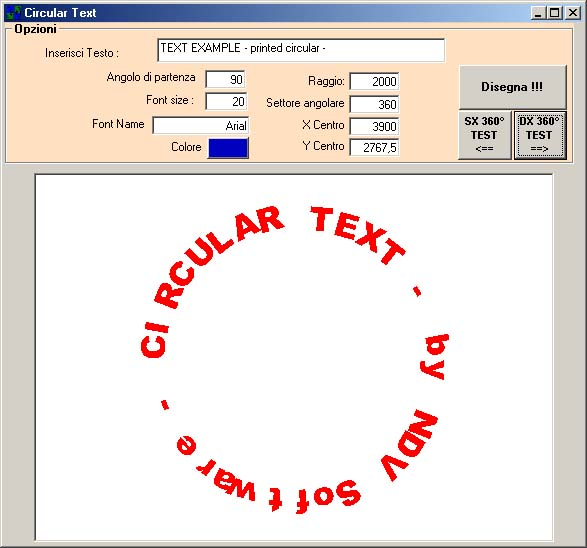



## Circular text printing

### Description

This example demostrate how is possible to write

a circular or arc text in a picture or in a Printer object.
 
### More Info
 
It's possible to change all the parameters like radius, font, color, sector and

many others.

             |
---                |---
**Submitted On**   |2001-05-12 14:34:42
**By**             |[NDV](https://github.com/Planet-Source-Code/PSCIndex/blob/master/ByAuthor/ndv.md)
**Level**          |Advanced
**User Rating**    |5.0 (10 globes from 2 users)
**Compatibility**  |VB 4\.0 \(16\-bit\), VB 4\.0 \(32\-bit\), VB 6\.0
**Category**       |[Graphics](https://github.com/Planet-Source-Code/PSCIndex/blob/master/ByCategory/graphics__1-46.md)
**World**          |[Visual Basic](https://github.com/Planet-Source-Code/PSCIndex/blob/master/ByWorld/visual-basic.md)
**Archive File**   |[Circular t195535122001\.zip](https://github.com/Planet-Source-Code/ndv-circular-text-printing__1-23146/archive/master.zip)

